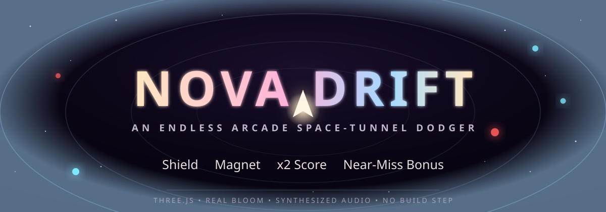
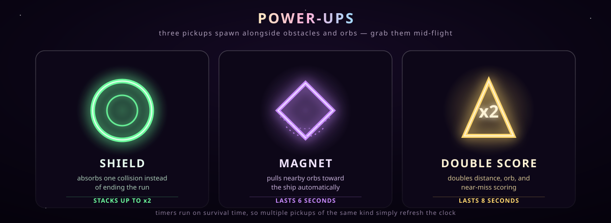
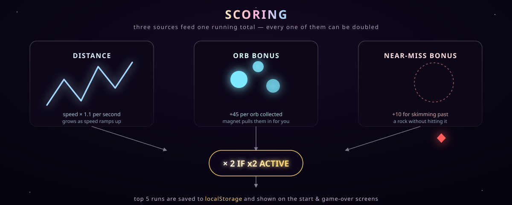
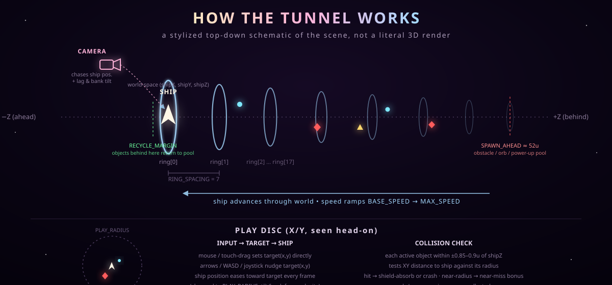

<div align="center">


**[▶ Play now — furkiozknn.github.io/nova-drift](https://furkiozknn.github.io/nova-drift/)**

</div>

---

Bir uzay tünelinde, gemin hep aynı noktada dururken tünel etrafında akıp gider — sen sadece sağa sola, yukarı aşağı süzülürsün. Kırmızı kayalara çarpma, camgöbeği küreleri topla, güçlendirmeleri kap ve hız durmadan artarken hayatta kalmaya çalış.

**Nova Drift**, gerçek [Three.js](https://threejs.org/) bloom post-processing'i, elle yazılmış parçacık sistemleri ve tamamen Web Audio API ile *canlı sentezlenmiş* bir ses motoruyla çalışan, tek dosyalık, build adımı olmayan bir tarayıcı oyunu. Hiçbir ses dosyası yok, hiçbir `npm install` yok — sadece `<script type="module">` ve bir CDN import map.

## Table of Contents

- [Gameplay](#gameplay)
  - [Controls](#controls)
  - [Power-Ups](#power-ups)
  - [Scoring](#scoring)
  - [Leaderboard](#leaderboard)
- [How It Works](#how-it-works)
  - [Scene, Camera & Tunnel](#scene-camera--tunnel)
  - [Bloom Pipeline](#bloom-pipeline)
  - [Particle Systems](#particle-systems)
  - [Object Pooling](#object-pooling)
  - [Synthesized Audio](#synthesized-audio)
  - [Accessibility](#accessibility)
- [Run Locally](#run-locally)
- [Project Structure](#project-structure)
- [Stack & Credits](#stack--credits)
- [License](#license)

---

## Gameplay

### Controls

| Input | Action |
|---|---|
| 🖱️ Mouse move | Ship follows your pointer directly |
| 👆 Touch-drag | A virtual joystick appears wherever you touch |
| ⌨️ Arrow keys / WASD | Nudge the ship left / right / up / down |
| `Space` / `Enter` | Start or restart the run |
| `Escape` / pause button | Pause — freezes the scene exactly where it was |

The ship never chases your pointer instantly — its position *eases* toward a target each frame, and the last frame's velocity drives a small bank-and-tilt rotation, so movement reads as inertia rather than teleportation.

### Power-Ups



Power-ups spawn in the same stream as obstacles and orbs — you have to fly through them like everything else. All three stack independently of each other:

| Power-up | Effect | Duration |
|---|---|---|
| 🛡️ **Shield** | Absorbs one collision instead of ending the run | Stacks up to **2** charges |
| 🧲 **Magnet** | Pulls every orb within range straight into the ship | **6 seconds** (refreshes on pickup) |
| ✨ **x2** | Doubles *all* scoring — distance, orbs, near-misses | **8 seconds** (refreshes on pickup) |

### Scoring



Your score is a running total of three sources, each of which the x2 power-up doubles:

- **Distance** — accrues continuously as `speed × 1.1` per second, so it snowballs as the run speeds up
- **Orb bonus** — a flat **+45** per cyan orb collected
- **💥 Near-miss bonus** — skim past an obstacle without touching it and you get **+10** plus a distinct chime — a small reward for flying dangerously close to the edge instead of playing it safe

### Leaderboard

The top **5** scores persist locally via `localStorage` and are rendered on both the start screen and the game-over screen, so you always know what you're chasing before you even hit start.

---

## How It Works

A quick tour of the moving parts under the hood — everything below is grounded directly in `script.js`, nothing aspirational.



### Scene, Camera & Tunnel

- The ship's world position (`shipX, shipY, shipZ`) actually advances forward through `-Z` every frame — it isn't the tunnel sliding toward a fixed ship, it's the whole rig moving through an infinitely recycled corridor
- **18** torus rings sit `RING_SPACING = 7` units apart; once a ring falls more than `RECYCLE_MARGIN` behind the ship, it's teleported back to the far end of the chain instead of being destroyed and recreated
- A `PerspectiveCamera` chases the ship with easing + lag on all three axes, banks on a Z-rotation driven by lateral velocity, and looks a fixed distance ahead down the tunnel
- Speed ramps continuously from `BASE_SPEED` to `MAX_SPEED` the longer you survive, driving both the scroll rate and the score-per-second
- A `FogExp2` fog and a full-screen AI-generated nebula texture (`assets/nebula.png`) sit behind everything to sell depth without extra geometry

### Bloom Pipeline

Real post-processing, not a CSS filter:

```
RenderPass → UnrealBloomPass(strength 0.62, radius 0.35, threshold 0.5) → OutputPass
```

Colors are rendered in `SRGBColorSpace` and finished with `ACESFilmicToneMapping` at `0.98` exposure, so bright emissive materials (obstacles, orbs, power-ups, the shield ring) bloom convincingly against the dark scene instead of just clipping to white.

### Particle Systems

Two independent point-cloud systems, both custom `ShaderMaterial`s with additive blending and pixel-ratio-aware point sizing so they stay crisp on high-DPI screens:

- **Starfield** — 700 points with a per-star phase offset driving a sine-wave twinkle in the fragment shader
- **Engine trail + impact bursts** — a shared pool of 70 particles. Idle exhaust spawns continuously behind the ship in alternating pink/cyan; a shield block spawns a one-off radial burst at the impact point. Both fade via a `life` value decayed each frame

### Object Pooling

Obstacles, orbs, and power-ups are never `new`'d mid-run. Fixed pools are allocated once at load —

| Pool | Size |
|---|---|
| Obstacles | 26 |
| Orbs | 26 |
| Power-ups | 9 (3 types × 3) |

— and each entry just toggles `visible` and gets repositioned when it spawns or recycles. Nothing is allocated or garbage-collected during play, which matters a lot when the scene is already pushing bloom + two particle systems + physics-adjacent collision checks every frame.

### Synthesized Audio

Every sound effect is generated live with the **Web Audio API** — there isn't a single audio file in the repo:

- Collect / power-up / shield-hit / near-miss chimes are short `OscillatorNode` tones (sine, triangle, or square waves) with hand-tuned gain envelopes
- The crash sound is a procedurally generated noise buffer run through a lowpass filter, layered with a low sawtooth thump
- A continuous engine drone plays while flying — a sawtooth oscillator through a lowpass filter, whose cutoff frequency tracks current speed in real time
- Mute state persists in `localStorage` and survives reloads

### Accessibility

Screen shake, the hit-flash overlay, and the title shimmer animation all check `prefers-reduced-motion` and quietly disable themselves when it's set — no motion-triggered discomfort for players who've asked their OS to avoid it.

---

## Run Locally

No install, no build, no bundler:

```bash
npx serve .
```

Then open the printed local URL. It **must** be served over HTTP (not opened via `file://`) because `index.html` loads Three.js through an ES module import map pointed at `unpkg.com` — browsers block ES module imports from the `file://` origin.

## Project Structure

```
nova-drift/
├── index.html          # markup, HUD, overlays, import map
├── styles.css           # HUD, overlays, joystick, buttons
├── script.js            # scene setup, game loop, audio, everything
└── assets/
    ├── banner.svg              # hero graphic (this README)
    ├── diagram-how-it-works.svg
    ├── powerups-strip.svg
    ├── scoring-breakdown.svg
    ├── ship.png / nebula.png   # AI-generated art
    └── icon_shield.png / icon_magnet.png / icon_mult.png  # in-HUD icons
```

## Stack & Credits

| | |
|---|---|
| **Engine** | [Three.js](https://threejs.org/) r160, loaded via an ES module import map from unpkg — no bundler, no `node_modules` |
| **Rendering** | Real bloom post-processing (`EffectComposer` + `UnrealBloomPass`), ACES filmic tone mapping |
| **Audio** | 100% synthesized with the Web Audio API — zero audio files |
| **Markup / styling** | Plain HTML + CSS, `Orbitron` display font via Google Fonts |
| **Art** | Ship sprite and nebula backdrop are AI-generated images; every line of game logic, rendering, and audio synthesis is hand-written |
| **Build step** | None. Clone it, serve it, play it |

## License

MIT — see [`LICENSE`](LICENSE).
