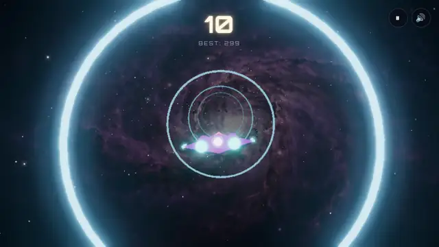
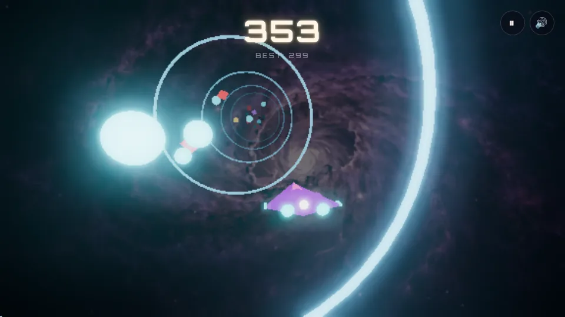

<div align="center">

**[▶ Play in your browser — furkiozknn.github.io/nova-drift](https://furkiozknn.github.io/nova-drift/)**



<sub>Real gameplay, not a montage: <code>node test/capture-gif.js</code> opens the game sealed to its own origin,
steers it with the keyboard and writes every frame. Six seconds of one run, 0.66 MB.</sub>


-7ee8ff?style=flat-square)
[](https://github.com/Furkiozknn/nova-drift/actions/workflows/ci.yml)

</div>

---

**Nova Drift** is an endless space-runner that plays in any modern browser. Your ship holds its line while a tunnel of light rushes past; you drift left, right, up and down to dodge red rocks, collect cyan orbs and grab power-ups, and the speed never stops climbing.

It is a small, honest piece of web tech: real [Three.js](https://threejs.org/) bloom post-processing, hand-written particle shaders, and an audio engine synthesized live with the Web Audio API — there is not a single sound file in the repository. Three.js and the font are vendored, so the page makes no request to any other origin. No bundler, no build step: serve the folder and play.

| | |
|---|---|
| **Play** | [furkiozknn.github.io/nova-drift](https://furkiozknn.github.io/nova-drift/) — or [run it locally](#run-locally) in one command |
| **Objective** | Survive as long as you can; score comes from distance, orbs and near-misses |
| **Controls** | Mouse / touch-drag / arrow keys or WASD · `Space`/`Enter` start · `Esc` pause |
| **Platform** | Desktop and mobile browsers with WebGL and import maps (Chrome/Edge 89+, Firefox 108+, Safari 16.4+) |
| **Weight** | About 0.8 MB on first load, 21 requests, all from the page's own origin |

## Table of Contents

- [Gameplay](#gameplay)
  - [Objective](#objective)
  - [Controls](#controls)
  - [Power-Ups](#power-ups)
  - [Scoring](#scoring)
  - [Leaderboard](#leaderboard)
  - [Daily Challenge](#daily-challenge)
- [How It Works](#how-it-works)
  - [Scene, Camera & Tunnel](#scene-camera--tunnel)
  - [Bloom Pipeline](#bloom-pipeline)
  - [Particle Systems](#particle-systems)
  - [Object Pooling](#object-pooling)
  - [Synthesized Audio](#synthesized-audio)
  - [Accessibility](#accessibility)
- [Platform & Performance](#platform--performance)
- [Run Locally](#run-locally)
- [Troubleshooting](#troubleshooting)
- [Testing](#testing)
  - [Manual smoke test](#manual-smoke-test)
  - [Regenerating the demo media](#regenerating-the-demo-media)
- [Project Structure](#project-structure)
- [Stack & Credits](#stack--credits)
- [License](#license)

---

## Gameplay



### Objective

Stay alive. A run ends the moment the ship touches a red rock (unless a shield absorbs the hit). Everything else is score: the distance you cover, the cyan orbs you collect and the rocks you skim past without touching. The run starts gentle and speeds up continuously, so every run ends eventually — the question is how far you get.

### Controls

| Input | Action |
|---|---|
| 🖱️ Mouse move | Ship follows your pointer directly |
| 👆 Touch-drag | A virtual joystick appears wherever you touch |
| ⌨️ Arrow keys / WASD | Nudge the ship left / right / up / down |
| `Space` / `Enter` | Start or restart the run |
| `Escape` / pause button | Pause — freezes the scene exactly where it was |
| Switch window / tab | Pauses automatically and releases any held key, so the ship does not drift into a wall while you are away |

The ship never chases your pointer instantly — its position *eases* toward a target each frame, and the last frame's velocity drives a small bank-and-tilt rotation, so movement reads as inertia rather than teleportation.

### Power-Ups


Power-ups spawn in the same stream as obstacles and orbs — you have to fly through them like everything else. All three stack independently of each other:

| Power-up | Effect | Duration |
|---|---|---|
| 🛡️ **Shield** | Absorbs one collision instead of ending the run | Stacks up to **2** charges |
| 🧲 **Magnet** | Pulls every orb within range straight into the ship | **6 seconds** (refreshes on pickup) |
| ✨ **x2** | Doubles *all* scoring — distance, orbs, near-misses | **8 seconds** (refreshes on pickup) |

### Scoring


Your score is a running total of three sources, each of which the x2 power-up doubles:

- **Distance** — accrues continuously as `speed × 1.1` per second, so it snowballs as the run speeds up
- **Orb bonus** — a flat **+45** per cyan orb collected
- **💥 Near-miss bonus** — skim past an obstacle without touching it and you get **+10** plus a distinct chime — a small reward for flying dangerously close to the edge instead of playing it safe

### Leaderboard

The top **5** scores persist locally via `localStorage` and are rendered on both the start screen and the game-over screen, so you always know what you're chasing before you even hit start.

### Daily Challenge

A toggle on the start screen ("GÜNLÜK MOD") switches spawning from real randomness to a **seeded** run: a small [mulberry32](https://github.com/bryc/code/blob/master/jshash/PRNGs.md) PRNG, seeded from the current UTC date (`YYYYMMDD` as an integer), replaces every `Math.random()` call in the obstacle/orb/power-up spawn logic. Two players who open the page on the same calendar day get the byte-for-byte identical spawn sequence — same obstacles, same orbs, same power-ups, in the same order — so their scores are genuinely comparable, not just two unrelated random runs.

Today's Daily Challenge best is tracked separately from the endless-mode top-5 (`localStorage` key `novaDriftDaily-YYYYMMDD`, one per day) so the two modes never mix. Regular endless mode is untouched — it still calls real `Math.random()` — this is strictly additive.

---

## How It Works

A quick tour of the moving parts under the hood — everything below is grounded directly in `script.js`, nothing aspirational.


### Scene, Camera & Tunnel

- The ship's world position (`shipX, shipY, shipZ`) actually advances forward through `-Z` every frame — it isn't the tunnel sliding toward a fixed ship, it's the whole rig moving through an infinitely recycled corridor
- **18** torus rings sit `RING_SPACING = 7` units apart; once a ring falls more than `RECYCLE_MARGIN` behind the ship, it's teleported back to the far end of the chain instead of being destroyed and recreated
- A `PerspectiveCamera` chases the ship with easing + lag on all three axes, banks on a Z-rotation driven by lateral velocity, and looks a fixed distance ahead down the tunnel
- Speed ramps continuously from `BASE_SPEED` to `MAX_SPEED` the longer you survive, driving both the scroll rate and the score-per-second
- A `FogExp2` fog and a full-screen nebula texture (`assets/nebula.webp`) sit behind everything to sell depth without extra geometry. Fog never touches a scene background, so the nebula renders at `backgroundIntensity = 0.2` — otherwise the one object nobody interacts with is the only one at full strength, and the gameplay reads as clutter on top of it

### Bloom Pipeline

Real post-processing, not a CSS filter:

```
RenderPass → UnrealBloomPass(strength 0.62, radius 0.35, threshold 0.5) → OutputPass
```

Colors are rendered in `SRGBColorSpace` and finished with `ACESFilmicToneMapping` at `0.98` exposure, so bright emissive materials (obstacles, orbs, power-ups, the shield ring) bloom convincingly against the dark scene instead of just clipping to white.

### Particle Systems

Two independent point-cloud systems, both custom `ShaderMaterial`s with additive blending and pixel-ratio-aware point sizing so they stay crisp on high-DPI screens:

- **Starfield** — 700 points with a per-star phase offset driving a sine-wave twinkle in the fragment shader
- **Engine trail + impact bursts** — a shared pool of 70 particles. Idle exhaust spawns continuously behind the ship in alternating pink/cyan; a shield block spawns a one-off radial burst at the impact point. Both fade via a `life` value decayed each frame

### Object Pooling

Obstacles, orbs, and power-ups are never `new`'d mid-run. Fixed pools are allocated once at load —

| Pool | Size |
|---|---|
| Obstacles | 26 |
| Orbs | 26 |
| Power-ups | 9 (3 types × 3) |

— and each entry just toggles `visible` and gets repositioned when it spawns or recycles. Nothing is allocated or garbage-collected during play, which matters a lot when the scene is already pushing bloom + two particle systems + physics-adjacent collision checks every frame.

### Synthesized Audio

Every sound effect is generated live with the **Web Audio API** — there isn't a single audio file in the repo:

- Collect / power-up / shield-hit / near-miss chimes are short `OscillatorNode` tones (sine, triangle, or square waves) with hand-tuned gain envelopes
- The crash sound is a procedurally generated noise buffer run through a lowpass filter, layered with a low sawtooth thump
- A continuous engine drone plays while flying — a sawtooth oscillator through a lowpass filter, whose cutoff frequency tracks current speed in real time
- Mute state persists in `localStorage` and survives reloads

### Accessibility

Screen shake, the hit-flash overlay, and the title shimmer animation all check `prefers-reduced-motion` and quietly disable themselves when it's set — no motion-triggered discomfort for players who've asked their OS to avoid it.

---

## Platform & Performance

- **Runs on** any browser with WebGL, ES modules and import maps — Chrome/Edge 89+, Firefox 108+, Safari 16.4+ — on desktop and mobile. The automated suite runs in Chromium; other engines are covered by the [manual smoke test](#manual-smoke-test). The page is also a PWA (`manifest.json`; "Add to Home Screen" launches it fullscreen).
- **First load** is about 0.8 MB uncompressed across 21 requests (measured in Chromium against a local server: 808,235 bytes; `vendor/three.module.min.js` is 671 KB of that). Nothing comes from another origin, so it works on locked-down networks and inside game-portal iframes.
- **Adaptive render scale.** A 60-frame moving average of frame time lowers the render scale in 0.15 steps (floor 0.6) when frames exceed 20 ms, and raises it in 0.1 steps below 12.5 ms, with a 2 s cooldown. The bloom pass is what a slow phone pays for, and it scales with pixel count.
- **No allocation during play.** Obstacles, orbs, power-ups, stars and trail particles are pooled (see [Object Pooling](#object-pooling)); the physics step clamps `dt` to 0.05 s so a stalled frame never teleports the ship.
- **Storage is optional.** Scores, the daily best and the mute switch live in `localStorage`; when a browser refuses site data (private mode, third-party iframe) the game still starts and plays, it just forgets on reload.

## Run Locally

No install, no build, no bundler. Serve the folder over HTTP and open it:

```bash
git clone https://github.com/Furkiozknn/nova-drift.git
cd nova-drift
python3 -m http.server 8000      # then open http://localhost:8000
# or, with Node:  npx serve .    # then open the printed URL
```

It **must** be served over HTTP: `index.html` loads Three.js through an ES module import map pointed at `./vendor/`, and browsers refuse module imports from `file://`.

## Troubleshooting

| Symptom | Cause and fix |
|---|---|
| Black page, nothing happens, console says a module was blocked | You opened `index.html` from disk. Serve the folder over HTTP (see above). |
| Black canvas, console mentions WebGL | WebGL is disabled or unavailable (remote desktop, blocklisted GPU driver). Enable hardware acceleration in the browser settings, or try another browser. |
| No sound | Browsers only allow audio after a user gesture — press START first. Check the 🔊 button; mute persists across reloads. |
| Low frame rate | The render scale drops automatically; give it two seconds. On very old hardware close other GPU-heavy tabs. |
| The HUD is in Turkish | The game follows the browser language: Turkish browsers get Turkish text, everything else gets English. |

## Testing

A dev-only Playwright suite; it adds no build step to the game itself, which stays plain static HTML/CSS/JS.

```bash
npm install
npx playwright install --with-deps chromium   # first run only
npm test                                      # 42 tests in 10 spec files
```

`PW_CHROMIUM_PATH=/path/to/chrome npm test` points the suite at an already-installed Chromium on machines without a browser download. Every spec runs with the page **sealed to its own origin**: any request to another origin is aborted, exactly as it would fail on a game portal's network, so a reintroduced CDN import breaks CI instead of passing it. CI (`.github/workflows/ci.yml`) runs the whole suite on Node 20 and 22 on every push and pull request.

| Spec | What it proves |
|---|---|
| `smoke.spec.js` | No console errors with default and reduced-motion loads; the Daily toggle works; `manifest.json` is well-formed |
| `focus.spec.js` | Switching window or tab pauses a running game and releases held keys |
| `prng.spec.js` | The Daily Challenge RNG, executed from the real `rng.js` (not a copy): same seed, same sequence; stable across a UTC day; pinned to today's shipped sequence |
| `adaptive.spec.js` | The render-scale decision function (thresholds, hysteresis, floor/ceiling), isolated and against the live page via `?debug=1` |
| `storage.spec.js` | The game starts, scores and mutes with `localStorage` throwing on every call |
| `no-external-requests.spec.js` | Nothing leaves the origin (observed, not just blocked) |
| `portal-sizes.spec.js` | The game starts and fits at the viewports Poki and CrazyGames require |
| `language.spec.js` | English markup; Turkish overlaid on a Turkish browser |
| `font.spec.js` | The vendored woff2 is served and Orbitron is what the HUD renders in |
| `vendor.spec.js` | `vendor/` is exactly what `scripts/vendor-three.mjs` produces from the pinned `three`, and regenerating keeps `vendor/fonts/` |

### Manual smoke test

Automated tests cannot judge feel. Before a release, play one run in a real browser with a real GPU:

1. Serve the folder, open it, and check the browser console stays free of errors.
2. Press `Space` — the run starts, the engine hum starts, the score counts up.
3. Steer with the arrow keys, then WASD, then the mouse; on a phone, touch-drag shows the joystick.
4. Press `Esc` — the scene freezes and the score stops; `Esc` again resumes. Switch to another tab and back — the game is paused.
5. Fly through an orb (+45 and a chime) and a power-up (icon appears under the score).
6. Crash into a rock — CRASH screen, final score, leaderboard; `Enter` starts a new run.
7. Toggle **DAILY MODE**, play, and confirm "today's best" is tracked separately from the top 5.
8. Mute with 🔊, reload, and confirm it stays muted.

### Regenerating the demo media

The animation and stills in this README are captured from the game itself, never drawn. Both scripts seal the page to its own origin, run the browser in `en-US` and drive the game clock with Playwright's fake clock, so each frame is exactly one step of game time even on a software renderer.

```bash
node test/capture-gif.js .capture 150 25          # 150 frames of real play at 25 fps -> .capture/k000.png ...
ffmpeg -y -framerate 25 -i .capture/k%03d.png \
  -vf "fps=12.5,scale=640:-2:flags=lanczos" \
  -c:v libwebp_anim -lossless 0 -quality 68 -compression_level 6 -loop 0 assets/gameplay.webp
node test/capture-shot.js assets/og-preview.jpg 4400 1200 630   # social-share card
```

The capture script retries up to six runs and keeps the longest, so the exact frames differ between captures. `.capture/` is git-ignored.

## Project Structure

```
nova-drift/
├── index.html          # markup, HUD, overlays, import map, OG/Twitter meta
├── styles.css           # HUD, overlays, joystick, buttons, daily-mode UI
├── script.js            # scene setup, game loop, audio, everything
├── rng.js                # the daily seed + PRNG, alone so tests can import it
├── manifest.json         # PWA manifest (installable, fullscreen)
├── package.json           # dev-only: Playwright test runner
├── playwright.config.js   # dev-only: Playwright config (serves the page over http, no build)
├── test/
│   ├── prng.spec.js        # seeded-RNG determinism, no browser rendering needed
│   ├── smoke.spec.js       # console-error + Daily Challenge UI + manifest checks
│   ├── focus.spec.js       # switching window/tab pauses the run and releases held keys
│   ├── adaptive.spec.js    # adaptive render-scale decision function, isolated + live
│   ├── storage.spec.js     # the game with localStorage throwing on every call
│   ├── no-external-requests.spec.js  # nothing may leave the origin
│   ├── portal-sizes.spec.js  # the viewports Poki and CrazyGames require
│   ├── language.spec.js    # English markup, Turkish overlaid on a Turkish browser
│   ├── font.spec.js        # the vendored woff2 really loads; Orbitron is what renders
│   ├── vendor.spec.js      # vendor/ matches the pinned three, and keeps the font
│   ├── fixtures.js         # seals the page to its own origin, shared by the specs above
│   ├── capture-gif.js      # dev-only: records gameplay frames for the README animation
│   └── capture-shot.js     # dev-only: a single still (before/after on the art, social card)
├── scripts/vendor-three.mjs  # copies the Three.js files the import graph reaches
├── vendor/                  # Three.js + the font, shipped so nothing is fetched
├── .github/workflows/ci.yml  # runs the suite on push/PR
└── assets/
    ├── banner.svg              # hero graphic (this README)
    ├── diagram-how-it-works.svg
    ├── powerups-strip.svg
    ├── scoring-breakdown.svg
    ├── gameplay.webp           # README animation, 6 s of real play (animated WebP, 0.66 MB)
    ├── screenshot.webp         # README still, one frame of the same run
    ├── og-preview.jpg          # social-share preview image (Open Graph / Twitter Card)
    ├── nebula.webp             # backdrop, 32 KB
    └── icon_shield.png / icon_magnet.png / icon_mult.png  # in-HUD icons
```

## Stack & Credits

| | |
|---|---|
| **Engine** | [Three.js](https://threejs.org/) r160, loaded via an ES module import map pointed at the vendored copy in `vendor/` — no bundler, no CDN, no `node_modules` at runtime |
| **Rendering** | Real bloom post-processing (`EffectComposer` + `UnrealBloomPass`), ACES filmic tone mapping |
| **Audio** | 100% synthesized with the Web Audio API — zero audio files |
| **Markup / styling** | Plain HTML + CSS, `Orbitron` shipped with the game — the portals reject any external request |
| **Art** | The ship is flat-coloured Three.js geometry, not a sprite: it is built along `-Z` so it reads as flying away from any angle and can actually bank into a turn. The nebula backdrop is an AI-generated image. Every line of game logic, rendering and audio synthesis is hand-written |
| **Build step** | None. Clone it, serve it, play it |

## License

MIT — see [`LICENSE`](LICENSE).

---

## Bu ekosistemden başka projeler

- **[masal](https://github.com/Furkiozknn/masal)** — çocuğun adına yazılan uyku öncesi masalı
- **[buradane](https://github.com/Furkiozknn/buradane)** — ihtiyaç odaklı 167.829 OpenStreetMap noktası
- **[turkce-ajanlar](https://github.com/Furkiozknn/turkce-ajanlar)** — Türkçe düşünen 70 Claude Code alt-ajanı

<sub>Hepsi tek bir aranabilir sayfada: **[furkiozknn.github.io](https://furkiozknn.github.io/)** — her kart, o deponun kendi <code>project-meta.json</code> dosyasından üretiliyor.</sub>
